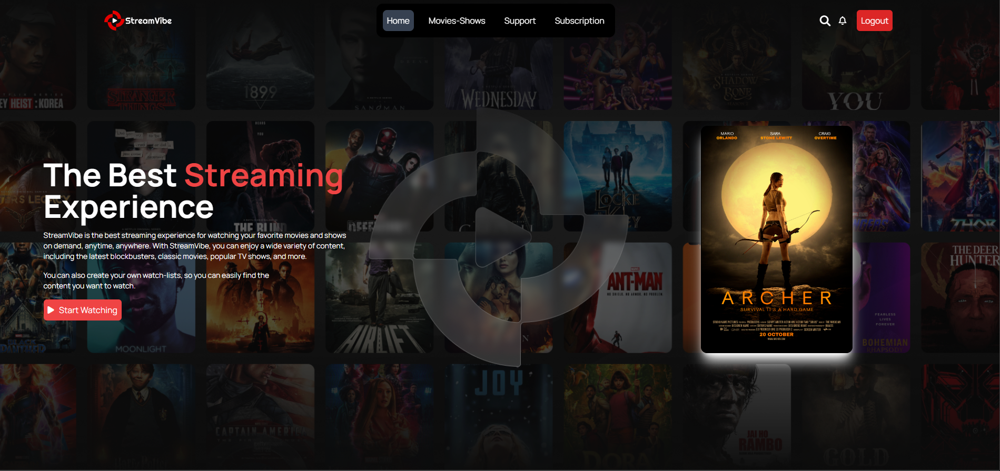

## Stream Vibe

Stream Vibe website built using react, Tailwind3, JavaScript, and Tailwind. That is used to Search and stream your favriot movies and series.

<a href="https://streamvibe-io.netlify.app/" target="_blank">**Visit Now** 🚀</a>

## 📌 Tech Stack

&nbsp;
&nbsp;

## 📌 Sneak Peek of Main Page 🙈 :

<h2>📬 Contact</h2>

Feel free to reach me through the below handles if you'd like to contact me.

## 💖 SanjeevKumar
